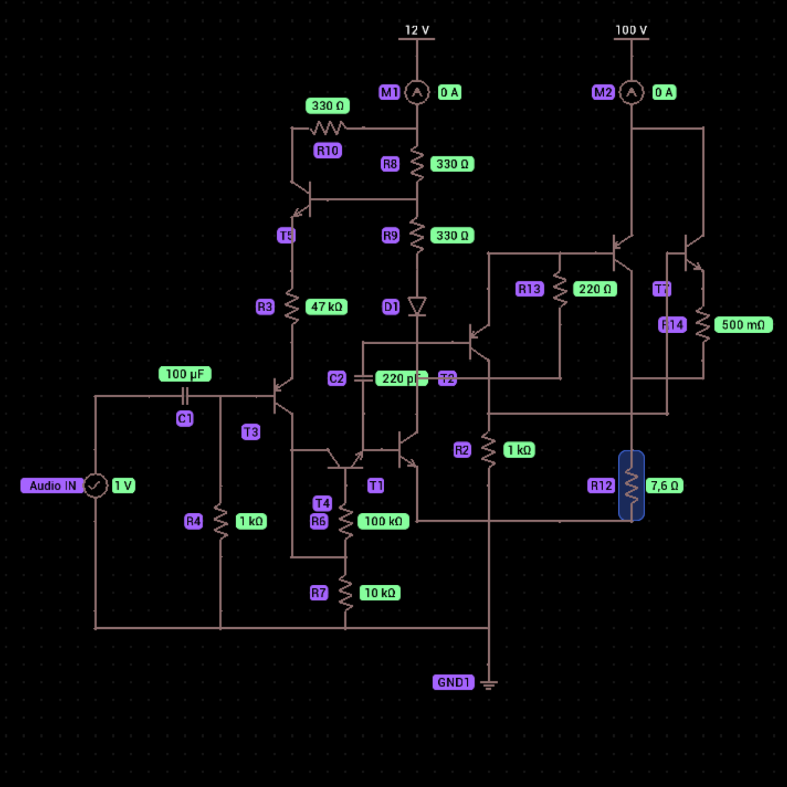

# Class-V-Amplifier

8ohm test:
```
1. Vcc = 5V
2. Icc = 616mA
3. Vout RMS = 2.8W
4. Iout RMS = 593mA
5. R bias A = 10k Ohm
6. R bias B = 10k Ohm
7. DC offset = 21.75mV

1. Vcc = 12V (Recommended)
2. Icc = 1.5A
3. Vout RMS = 18W
4. Iout RMS = 1.48A
5. R bias A = 27k Ohm
6. R bias B = 10k Ohm
7. DC offset = 22.37mV

1. Vcc = 24V
2. Icc = 3A
3. Vout RMS = 71W
4. Iout RMS = 2.97A
5. R bias A = 57k Ohm
6. R bias B = 20k Ohm
7. DC offset = 46.88mV

High voltage test:

1. Vcc = 45V
2. Icc = 4A
3. Vout RMS = 126W
4. Iout RMS = 3.97A
5. R bias A = 100k Ohm
6. R bias B = 56k Ohm
7. DC offset = 167.58mV
8. R bias C = 66k Ohm
```

which i noted, the higher the voltage, the more unstable it is. So i decided on 12V, and created topology V2.0 from it by making it split supply, and added transistors to regulate the biasing, to become some sort of logic gates, reacting to input signal voltage:
```
[Split Supply]
1. Vcc Input Stage = 12V
2. Vcc Main = 60V
3. Icc Main = 8.1A
4. Vout RMS = 472W @8ohm load
5. Iout RMS = 7.88A @8ohm load
6. R bias A = 100k Ohm (R6)
7. R bias B = 10k Ohm (R7)
8. R bias C = 47k Ohm (R3)
9. Ve = 727.89mV
10. DC offset = 21.86mV
11. Idle current = 100.87uA

[Split Supply]
1. Vcc Input Stage = 12V
2. Vcc Main = 48V
3. Icc Main = 6.5A
4. Vout RMS = 302W @8ohm load
5. Iout RMS = 6.3A @8ohm load
6. R bias A = 100k Ohm (R6)
7. R bias B = 10k Ohm (R7)
8. R bias C = 47k Ohm (R3)
9. Qinput Ve = 727.89mV
10. DC offset = 21.75mV
11. Idle current = 100.87uA (micro ampere)
```

The thing i call it as "Qinput Ve" and is the AND logic. But it's tripled, AND>AND Logic,

And if we wrote it in pseudo-code, the logic looked like this:
```
if (A == 1 && B == 1) { C = input_signal ? input_signal_level; }

pre_gain = C * Vcc_low;
I_gain = pre_gain * total_transistor * Vcc_high * Icc_high; 
```
A is basically transistor that check if there even any signal. B is the threshold logic i said earlier. While C is the final check.

C then passing it to D(pre_gain), and D is the Class A topology NPN common emitter, and then D passing it to high voltage area(total_transistor), which become Follower Emitter configuration.

Ray Vietii 2025
